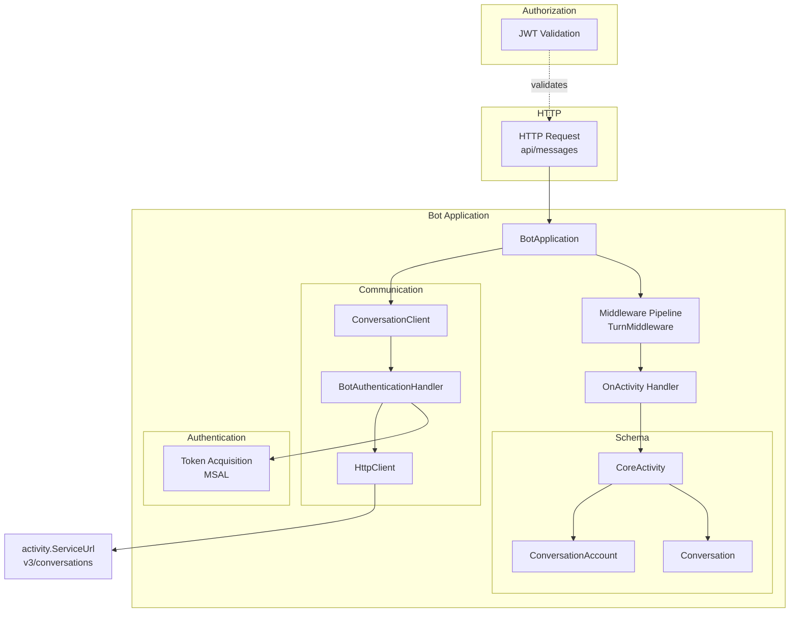
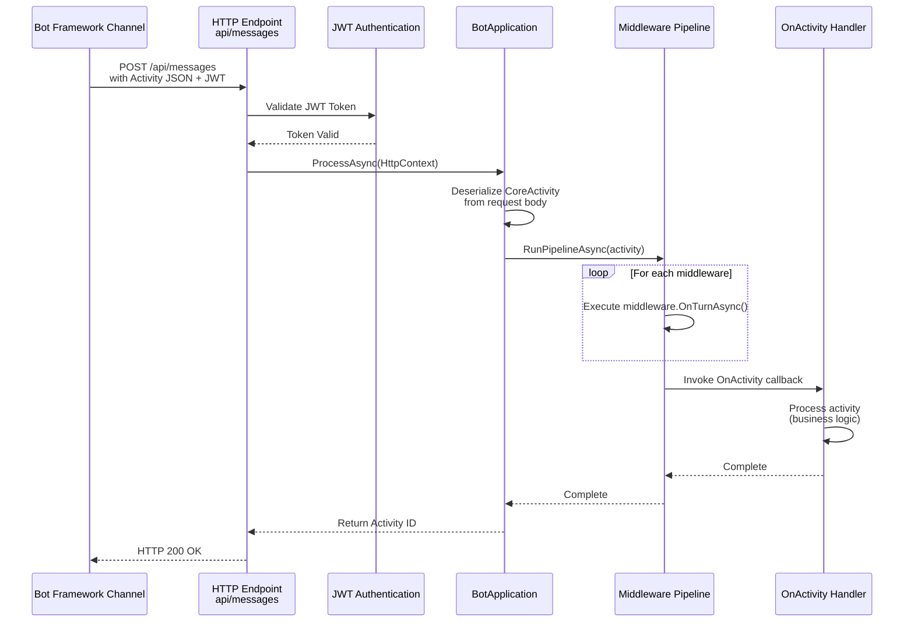
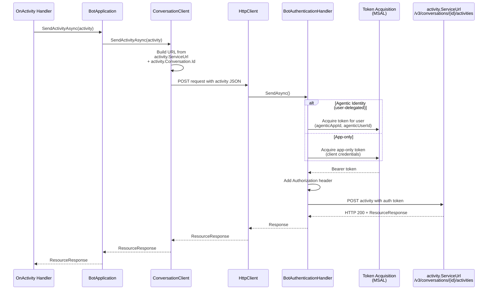
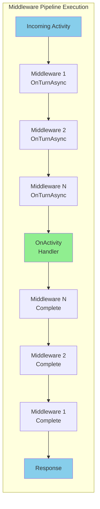
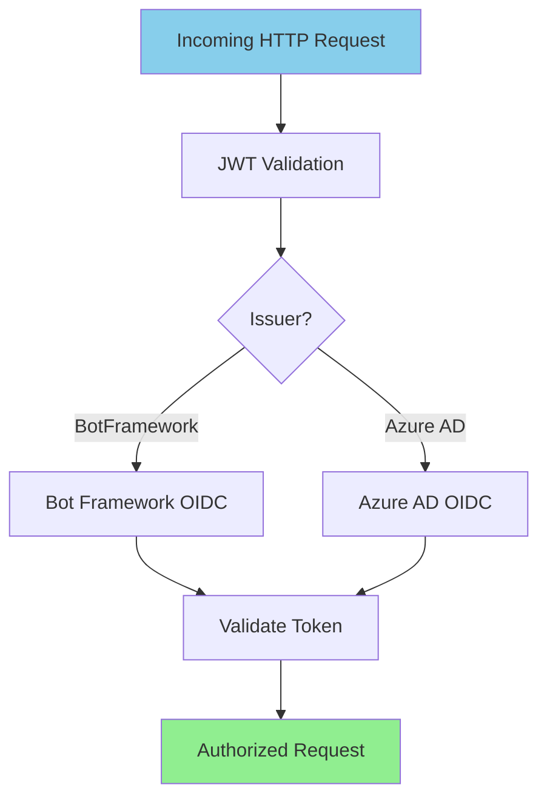
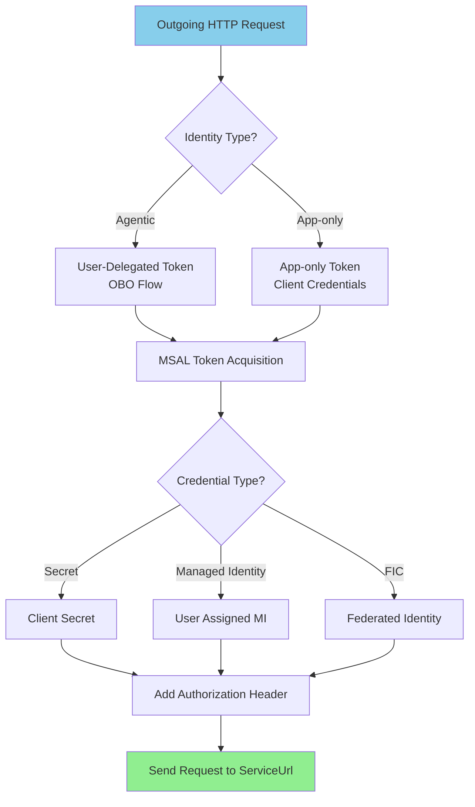

# Microsoft.Bot.Core Architecture

This document describes the architecture of the Teams.NET Core bot framework located in the `core/` folder (from the `next/core` branch).

## Overview

The Microsoft.Bot.Core framework provides a lightweight, modern .NET implementation for building bot applications that communicate with Microsoft Bot Framework and Teams services. The architecture focuses on receiving HTTP activity requests and sending responses back to conversation endpoints.

## Main Components

## HTTP Request Flow (Receiving Messages)

This diagram shows how incoming HTTP requests are processed when a message arrives at the `api/messages` endpoint.

## Activity Message Sending Flow (to ServiceUrl)

This diagram shows how the bot sends activity messages back to the conversation endpoint.

## Middleware Pipeline

The middleware pipeline allows interception and processing of activities before they reach the bot handler.

## Inbound Authentication Flow

This diagram shows how incoming HTTP requests are authenticated using JWT tokens.

## Outbound Authentication Flow

This diagram shows how the bot authenticates when sending messages to the Bot Framework service.

## Key Components Description

### BotApplication
- **Purpose**: Main entry point for bot functionality
- **Responsibilities**:
  - Processes incoming HTTP requests containing activities
  - Manages middleware pipeline execution
  - Provides methods to send activities back to conversations
  - Handles authentication configuration

### CoreActivity
- **Purpose**: Represents a bot activity (message, event, etc.)
- **Key Properties**:
  - `Type`: Activity type (message, typing, conversationUpdate, etc.)
  - `Text`: Message content
  - `ServiceUrl`: Endpoint URL for sending responses
  - `Conversation`: Conversation context
  - `From`/`Recipient`: Participant accounts
  - `ChannelData`: Channel-specific data

### ConversationClient
- **Purpose**: Sends activities to conversation endpoints
- **Responsibilities**:
  - Constructs the target URL from activity.ServiceUrl
  - Serializes activities to JSON
  - Uses authenticated HttpClient to POST activities
  - Returns ResourceResponse with activity ID

### Middleware Pipeline (TurnMiddleware)
- **Purpose**: Provides extensibility through middleware chain
- **Features**:
  - Sequential execution of registered middleware
  - Each middleware can inspect/modify activities
  - Common uses: logging, typing indicators, state management

### BotAuthenticationHandler
- **Purpose**: Handles outbound authentication for Bot Framework API calls
- **Features**:
  - Acquires OAuth tokens using MSAL
  - Supports app-only (client credentials) authentication
  - Supports agentic (user-delegated) authentication via OBO flow
  - Supports multiple credential types: secret, managed identity, federated identity
  - Attaches Bearer token to outgoing requests

### JWT Authentication
- **Purpose**: Validates incoming requests from Bot Framework
- **Features**:
  - Validates JWT tokens from Bot Framework or Azure AD
  - Dynamic OIDC configuration based on token issuer
  - Supports both bot and agent authentication schemes

## Request/Response Flow Summary

1. **Incoming Request**: Bot Framework posts activity to `api/messages`
2. **Authentication**: JWT token validated against OIDC configuration
3. **Deserialization**: Request body deserialized to CoreActivity
4. **Middleware Pipeline**: Activity passed through registered middleware
5. **Handler Execution**: OnActivity callback processes the activity
6. **Send Response**: Bot creates reply activity and calls SendActivityAsync
7. **Outbound Auth**: Token acquired via MSAL for the ServiceUrl
8. **HTTP POST**: Activity sent to `{ServiceUrl}/v3/conversations/{id}/activities`
9. **Response**: ResourceResponse with activity ID returned

## Configuration

The framework supports multiple configuration approaches:
- **Bot Framework Config**: MicrosoftAppId, MicrosoftAppPassword, MicrosoftAppTenantId
- **Core Config**: CLIENT_ID, CLIENT_SECRET, TENANT_ID
- **Azure AD Section**: AzureAd:ClientId, AzureAd:ClientSecret, etc.

Authentication credentials support:
- Client Secret (development)
- User-Assigned Managed Identity (production)
- Federated Identity Credential with Managed Identity (Azure workload identity)
